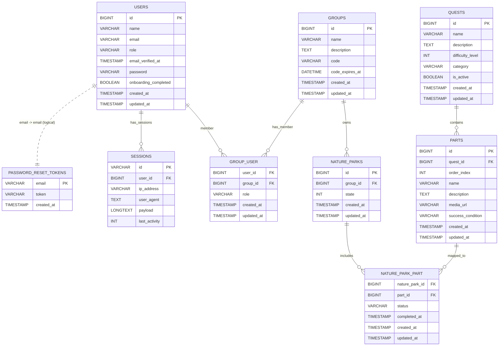

# Detective Green
A web-app that encourages first-year high school students to take real action for nature!

:mag: Check out the live version: https://team2.hr-cmgt-tle2-laravel.nl

<details>
    <summary>Table of Contents</summary>
    <ol>
        <li><a href="#about-this-project">About this project</a></li>
        <li><a href="#functionality">Functionality</a></li>
        <li>
            <a href="#getting-started">Getting started</a>
            <ol>
                <li><a href="#requirements">Requirements</a></li>
                <li><a href="#installation">Installation</a></li>
            </ol>
        </li>
        <li>
            <a href="#how-does-it-work">How does it work?</a>
            <ol>
                <li><a href="#build-with">Build with</a></li>
                <li><a href="#entity-relationship-diagram">Entity Relationship Diagram</a></li>
            </ol>
        </li>
    </ol>
</details>

[](https://github.com/BryanBooij)
[](https://github.com/Konijnebeer)
[](https://github.com/lisa-mao)
[](https://github.com/Noirxa)
[](https://github.com/Semmetje11lolly)


## ℹ️ About this project
Detective Green is the web-app to get first-year high school students excited about nature again! By collaborating with your class on various quests, they'll truly feel like their actions are making an impact!

This project was commissioned by and created in collaboration with Natuurmonumenten and iO. Natuurmonumenten struggles to reach young people between the ages of 12 and 21. Detective Green ensures that Natuurmonumenten can raise awareness of nature by encouraging green behavior and the making an impact on nature through a curriculum for high schools.


## ✨ Functionality
Detective Green is packed with cool features to easily integrate the web-app into your current curriculum!
### Quests
- Complete a variety of Quests, together with your class or at home!
- Discover unique types of Quests, from impact-making to multiple-choice questions!
- Receive rewards for completing Quests!
### Rewards
- Get points for completing Quests!
- Improve your own digital Nature Reserve by cleaning it and adding more plants and biodiversity!
### Leaderboard
- Climb the global leaderboard by collecting more points with your class!
- Become the best Green Detective!
### Management for Teachers
- Easily create new classes!
- Generate class-codes for your students to join your class!
- Manage members of your class by assigning roles like Student, Teacher or Guest!


## 🚀 Getting started
If you want to run the project locally, use the following steps.
### Requirements
- PHP 8.2+
- Composer
- Node.js & NPM
- SQLite
- (If on Windows) Laravel Herd
### Installation
1. Clone the repository
```sh
git clone https://github.com/Konijnebeer/TLE-2.git detective-green
cd detective-green
```
2. Setup dependencies, environment, database and front-end assets
```sh
composer run setup
```
3. Setup local test server
```sh
npm run dev
```
- If you're using Windows:
    - Make sure the project is in the Laravel Herd sites directory and SSL is enabled for it
    - View the web-app by going to https://detective-green.test
- If you're not on Windows:
    ```sh
    php artisan serve
    ```
    View the web-app by going to http://localhost:8000


## 🛠️ How does it work?
### Build with
Detective Green is build using the following technologies:
- [![Laravel][Laravel.com]][Laravel-url]
    - [![Blade][Blade.com]][Blade-url]
    - [![Laravel Breeze][Breeze.com]][Breeze-url]
- [![Tailwind CSS][TailwindCSS.com]][TailwindCSS-url]
- [![JavaScript][JavaScript.com]][JavaScript-url]
- [![SQLite][SQLite.com]][SQLite-url]
### Entity Relationship Diagram
Detective Green's Database logic is as follows:



[Laravel.com]: https://img.shields.io/badge/Laravel-FF2D20?style=for-the-badge&logo=laravel&logoColor=white
[Laravel-url]: https://laravel.com
[TailwindCSS.com]: https://img.shields.io/badge/Tailwind_CSS-38B2AC?style=for-the-badge&logo=tailwind-css&logoColor=white
[TailwindCSS-url]: https://tailwindcss.com
[JavaScript.com]: https://img.shields.io/badge/JavaScript-F7DF1E?style=for-the-badge&logo=javascript&logoColor=black
[JavaScript-url]: https://developer.mozilla.org/en-US/docs/Web/JavaScript
[SQLite.com]: https://img.shields.io/badge/SQLite-003B57?style=for-the-badge&logo=sqlite&logoColor=white
[SQLite-url]: https://www.sqlite.org
[Blade.com]: https://img.shields.io/badge/Blade-FF2D20?style=for-the-badge&logo=laravel&logoColor=white
[Blade-url]: https://laravel.com/docs/blade
[Breeze.com]: https://img.shields.io/badge/Breeze-FF2D20?style=for-the-badge&logo=laravel&logoColor=white
[Breeze-url]: https://laravel.com/docs/starter-kits#laravel-breeze
